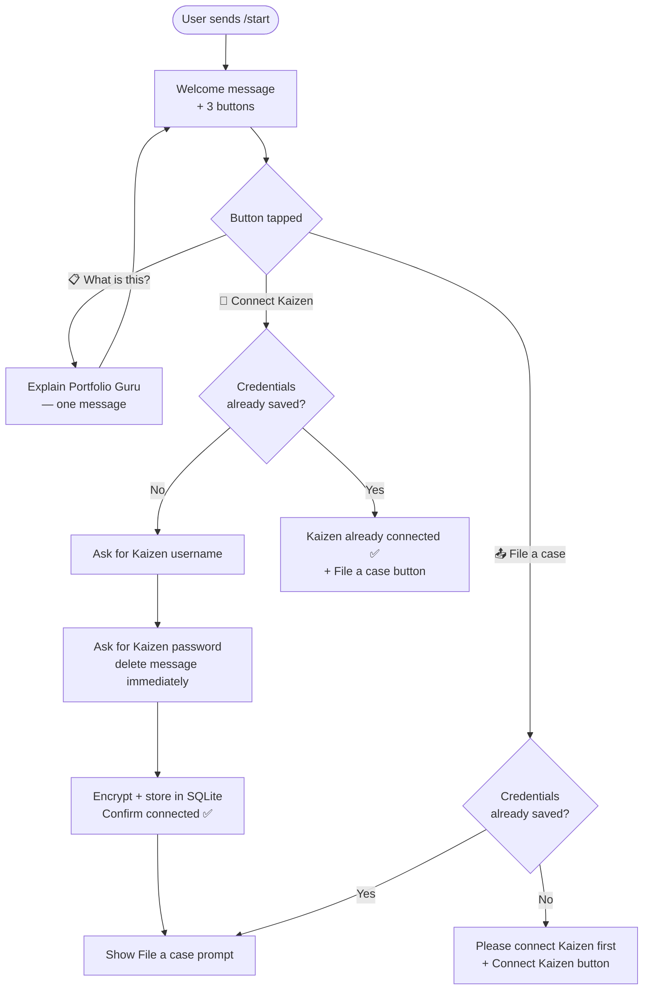
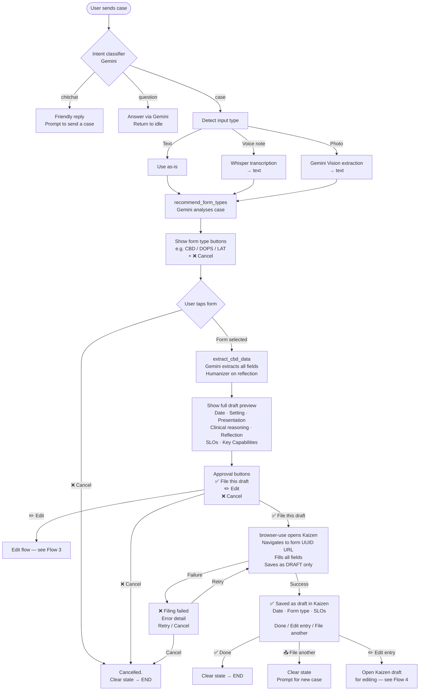
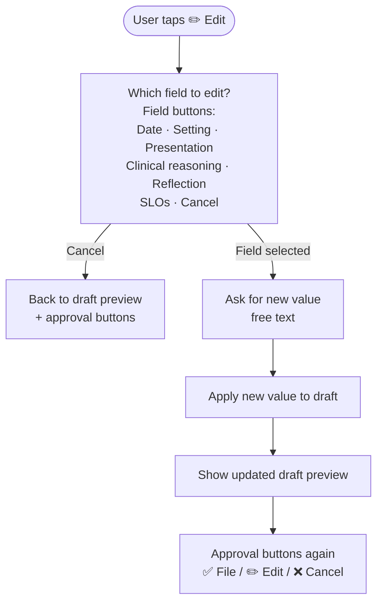
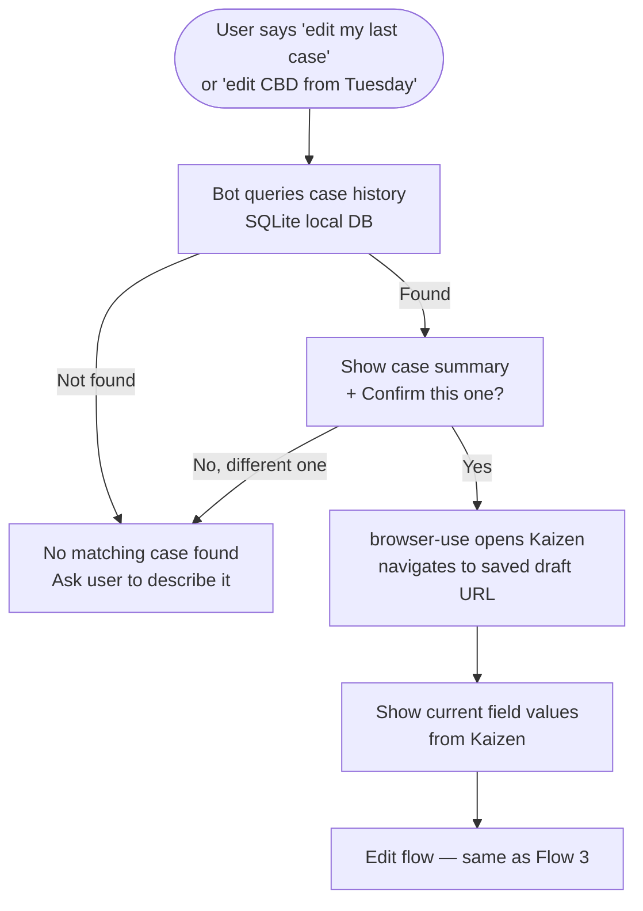
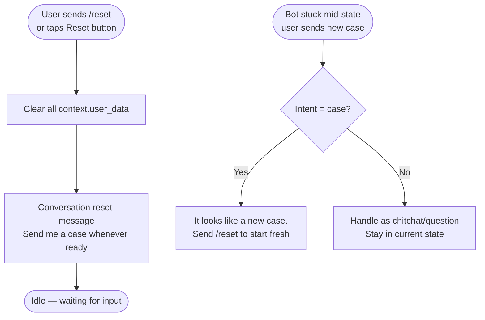
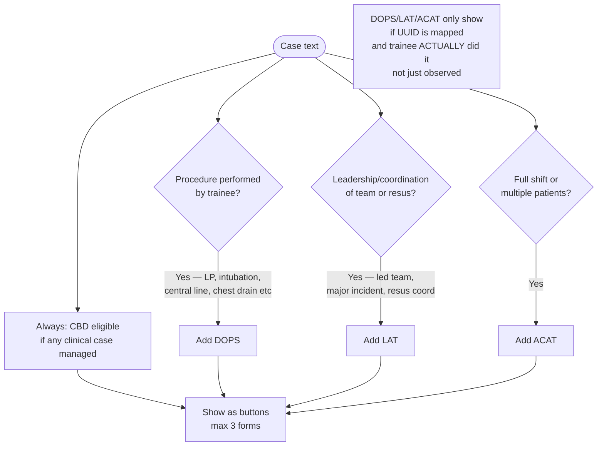
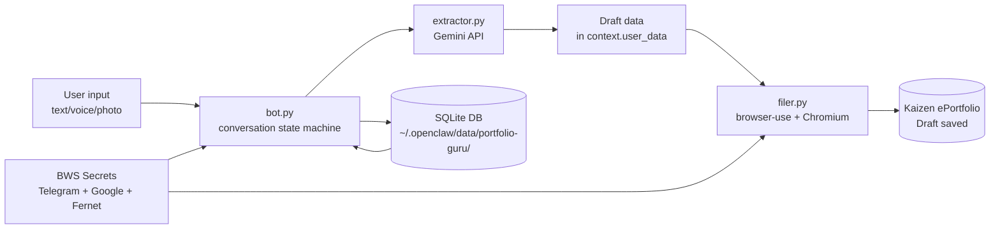

# Portfolio Guru — Workflow Reference
> Last updated: 2026-03-07
> Source of truth for all conversation flows. Update this file whenever a flow changes.
> Mermaid diagrams — render at mermaid.live or in any Markdown viewer that supports it.

---

## 1. First-Time User Flow

---

## 2. Core Filing Flow (Happy Path)

---

## 3. Edit Flow (Before Filing)

---

## 4. Edit Previously Filed Draft (v2.1 — not yet built)

---

## 5. Reset / Recovery Flow

---

## 6. Form Type Decision Logic

---

## 7. State Machine (Conversation States)

| State | Description | Exit triggers |
|-------|-------------|---------------|
| `IDLE` (no state) | Waiting for any input | Any message → intent classification |
| `AWAIT_FORM_CHOICE` | Waiting for form type button | FORM\|x → extraction; CANCEL → END |
| `AWAIT_APPROVAL` | Draft shown, waiting for decision | APPROVE → file; EDIT → edit flow; CANCEL → END |
| `AWAIT_EDIT_FIELD` | Asked which field to edit | FIELD\|x → ask for value; CANCEL → back to approval |
| `AWAIT_EDIT_VALUE` | Waiting for new field value | Any text → update draft → back to approval |
| `AWAIT_USERNAME` | Setup: waiting for username | Any text → ask password |
| `AWAIT_PASSWORD` | Setup: waiting for password | Any text → store → confirm |

**Rule:** Every path to `ConversationHandler.END` must call `context.user_data.clear()` first.

---

## 8. Data Flow

---

## Key Constraints (never violate)
- **NEVER submit** CBD to supervisor — draft save only
- **NEVER log** credentials in plaintext
- **NEVER open Kaizen** before user taps ✅ File this draft
- **NEVER select a KC** unless the trainee directly demonstrated it in this case
- Date format for Kaizen: `d/m/yyyy` (not ISO)
- KC over-selection is a bug — be conservative, not liberal

---

## Pending (v2.1)
- [ ] "Are we done?" button after successful filing
- [ ] Case history in SQLite — edit previously filed drafts
- [ ] Deterministic button structure at every state (AI populates text only)
- [ ] Portfolio type selection (Kaizen first, SOAR/LLP later)
- [ ] Usage limits + Stripe monetisation gate
- [ ] Settings menu (change portfolio, change credentials, view usage)
